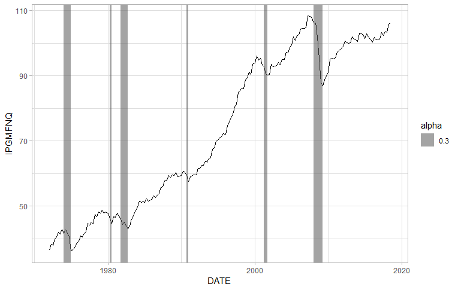

# recessionR
A R package that allows you to plot NBER recessions gray boxes, both in base plot and in ggplot2. I got the data from the Federal Reserve Bank of ST Louis aka FRED. [Here is the original series](https://fred.stlouisfed.org/series/USREC)

## Installing

This is not yet available at CRAN, but you can install using the **devtools** package:

```
devtools::install_github("danmrc/recessionR")
```

IF you are using Windows, you must have [RTools](https://cran.r-project.org/) installed (this is not a package!)

## Examples

For example, lets plot the quartely industrial manufacturing production of USA (you can get it from [FRED](https://fred.stlouisfed.org/series/IPGMFNQ)) and the command `plot_recession` allows you to see when there is a recession using the classic gray shade areas. For example, if you save the Industrial Production series as `ind_prod`, the following code:

```
plot(ind_prod)
plot_recession("q")

```

Generates the following figure:


And now the example for ggplot2. We assume you have a data frame named dat, with two columns, _DATES_ and _IPGMFNQ_ - this is exactly the names you would get downloading the .csv from FRED's website:

```
dat[,1] <- as.Date(dat[,1])

ggplot() + geom_line(data = dat,aes(DATE,IPGMFNQ)) + nber_recession_ggplot("q",start_date = dat$DATE[1],end_date = dat$DATE[187]) + theme_light()
```

And the result would be:



## Reproducibility

The _dataraw_ folder contains both the files that you get from FRED (if you choose to download them in .csv) and the scripts used to build the database. Due to differences between the way the `plot`command and **ggplot** deal with dates, they use diferent methods to get the start and end of recessions. But, besides some bug, they should match. 
